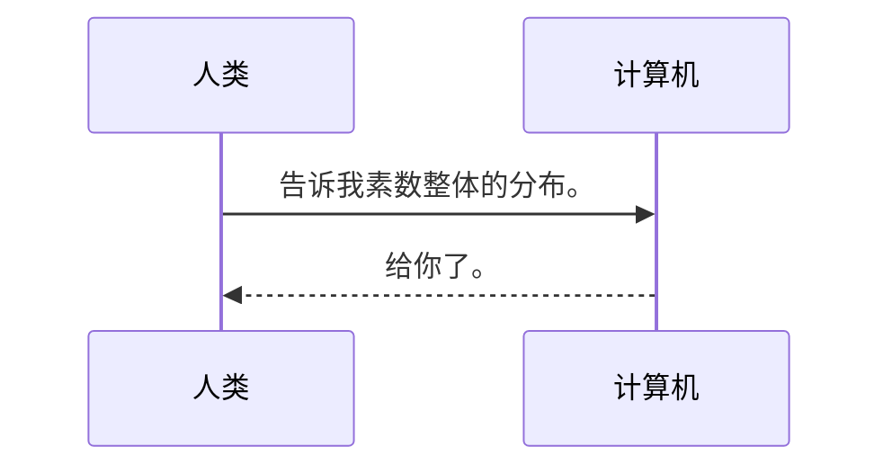
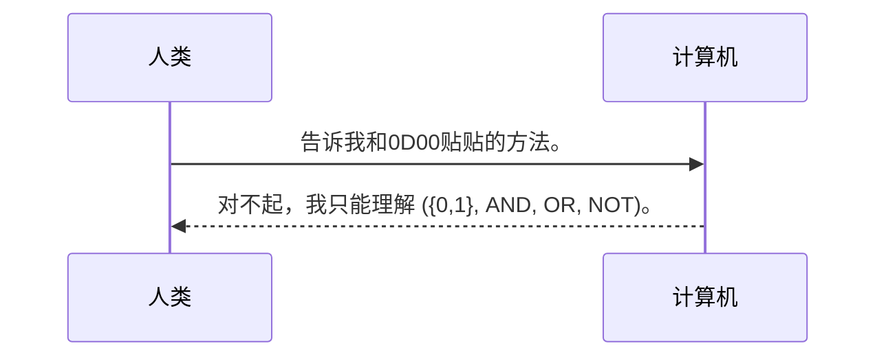
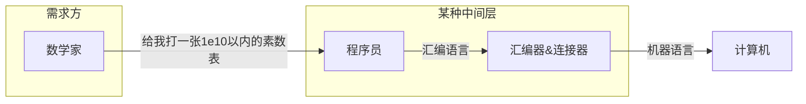
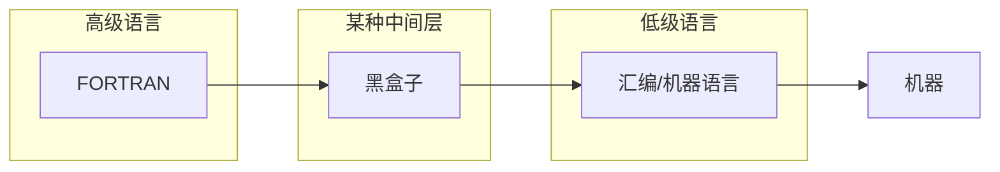
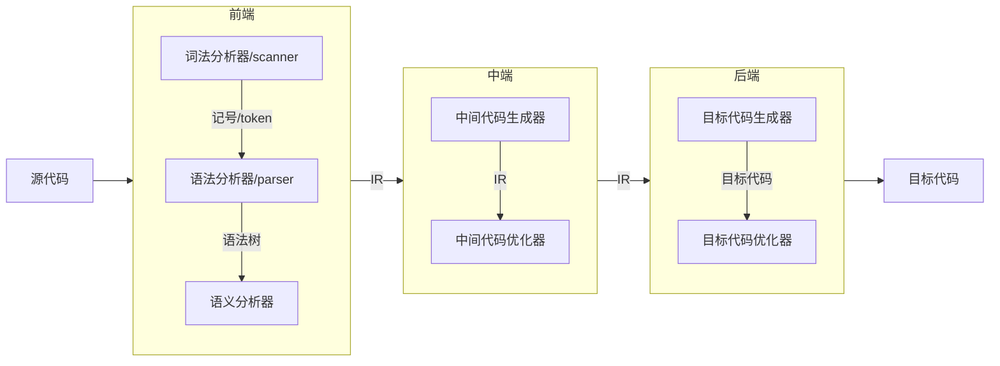
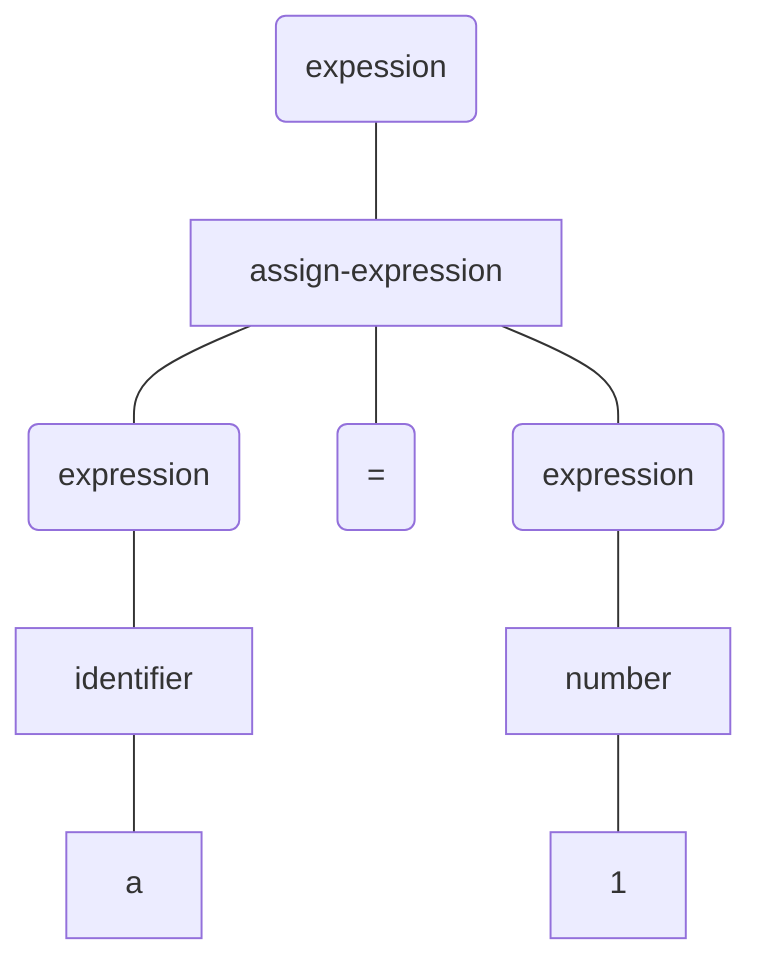

# 概论

## 从远古和底层讲起

人类发明计算机当然是想让计算机自动化地帮人类完成一些任务。这个任务最好能以自然语言来描述。



但是现实是，我们现在构造的计算机实际上只能理解定义在布尔数上的与或非运算。



受限于科技发展，计算机从诞生之初就需要人类由人类自身将自己的想法从自然语言转换成计算机能理解的语言————机器语言，各处理器厂商都定义了一系列指令集和专用硬件来将与或非组合成各种丰富的功能，譬如取数、加减乘除、跳转等等等等。这就是我们对硬件的第一层屏蔽，或者我们说这构建了一层薄薄的中间层，用以将人类的想法翻译给机器，这样我们就不需要关注门电路的开关与组合这些底层得不能再底层的细节，也即人类可以通过编程这个行为让计算机来完成一些事情。


当然上面太抽象了，在计算机发明之初，对计算机计算能力有需求的人群主要是研究数学和物理的，早期的硬件性能有限，所以在编程时还需要格外关注内存等硬件知识。这是数学家和物理学家所不想要过分关注的，他们或许能把要求解的问题转换成能离散逼近的算法，但也是更接近于伪代码的自然语言。于是伪代码到机器语言的翻译者出现了————程序员（编者注：某种程度上来说程序员是一种编译器）。

同时，由于是一系列的 01 组合，机器语言的识记难度对于专业程序员来说也不算小了，为了更方便编程和表达，与机器语言一一对应的汇编语言诞生了，汇编语言本质上只是机器语言的助记符，只需要通过汇编器和链接器，就能把 ASCII 码定义的汇编助记符对应到机器码上，从而完成可执行程序（一系列安排好的机器码，CPU 会知道如何正确处理它的）的构造。

现在，我们为了能让计算机帮我们处理问题而引入的中间层越来越厚，功能也越来越多了。



随着积累的知识越来越多，细分方向越来越细，计算能力的需求方————物理学家和数学家们（可能还有一些军队和商业人士）发现和程序员的沟通占了大部分的时间，因为把自己的需求翻译成程序员能听懂的算法也不再是简单的事情了，与其让程序员去弄懂已经足够晦涩而方向又多的专业知识，不如掌握这些知识的人来学习编程还更有效率一些。

这就出现了让不懂计算机底层知识的人也能通过编程指挥计算机干活的需求。尽管后面又在汇编的基础上发展了一些助记符，逐渐发展出了一些非汇编的编程语言，但是一个助记符对应一条/一组机器指令的编码方式扩展性太低了，并且可读性也不高，更别说各家公司的各种型号的机器会对应一套自己的汇编语言，对计算机底层的屏蔽还不够。

于是，一门解决这些痛点的语言 FORTRAN 诞生了。尽管在 FORTRAN 诞生前还有一些其它非汇编语言，但正如汇编是机器语言的助记符，那些语言是助记符的助记符，Fotran 作为第一门高级语言，不再对机器语言一一对应而更靠近人类的自然语言。但这也引入了一个问题，我们怎么样能将 FOTRAN 程序转换成机器能懂的汇编/机器语言呢？之前的需求翻译工作是由程序员来完成，假设这个过程仍由程序员来完成，那就失去了造这门语言的意义，那么是否有办法自动完成这个过程呢？由高级语言 FORTRAN 直接翻译成机器语言过于繁琐，而从 FORTRAN 到汇编更像是从语言到语言的翻译，现在我们的需求就确定了。



聪明的同学已经知道了，这个中间层和盒子就是本门课程的目标！不，不全是。汇编/机器语言或者说低级语言的一个特性是不遇到跳转语句就是完全地从上到下**一条一条**执行指令，那么我们的这个中间层完全可以有两种设计思路，一种是：每翻译一条 FORTRAN 程序就转换成一条/一批低级语言然后执行；另一种是：**把所有的 FORTRAN 语句都翻译成低级语言了再让它们一条一条执行。** 前一种会有在**执行过程中**才会发现错误的特点，当年受限于硬件性能导致的机时不足而对语言**性能**以及希望有某种机制**检验编程是否正确**的需求，这个中间层采用了后一种设计，也就是我们所称的**编译**，前一种我们称为**解释**。很显然，编译才是本门课的目标，但也请同学们不要忘记，现代的许多动态语言都是建立在解释执行之上的，采用哪种设计，无非是目的与实践的权衡，并无好坏之分。值得注意的是，某种意义上来说，低级语言算是解释执行的，这在接下来的一些内容中会埋下伏笔。

## 自底向上？不，自顶向下。

有不少同学和前辈都认为，《编译原理》这门课应当从第一性原理出发，教会大家当年的造编译器的人是怎么想到每一个模块是怎么划分并且造出来的。很可惜，并不会。这门课哪怕是大家认为吊打国内课程的国外公开课 CS143 也是自顶向下教授的，即，告诉你一个编译器应该分为多少个模块，每个模块有哪些技术，你要掌握这些技术并且能将他们运用起来。至于合理性以及读者是否能从中想到改进的技术或者获得什么 insight，这并非一门本科生课应当承担的任务。

尽管各种教材在细节上会有所不同，但是大体来说，大家公认，一个现代编译器应当被划分为如下几个模块并具有如下输入、输出以及功能：



其中前端和后端对于实现一个编译器最小功能必不可少的部分，中端是作为跨平台和优化的目的存在的。

现代编译器已经将前端的功能实现研究得很完备了，一个典型的例子是我们可以通过很多自动化工具(flex/bison/javacc)在半小时内构造好自己的前端，目前各大公司在前端的研究大多集中在错误提示这个点上，讽刺地是，要实现这个点需要抛弃自动化工具和各种优秀文法，手动递归下降实现前端。

前端的词法分析器**接受一段代码，输出代码可能代表的记号**，以一段 C 风格代码为例：

```c
    int   a       =     1      ;
//  类型  标识符  等号   数字   分号
```

一个合格的词法分析器应当能按照上面的例子接受源代码，输出下面注释中各符号的意义。

语法分析器，则需要分析出源代码的前后信息也就是一串符号序列代表的信息，它包括符号与符号之间的关系，以及符号的顺序（比如四则运算）带来的信息。这个信息通常以“二叉树”的形式给出，符号之间有关系的自然代表它们在一棵二叉树中，对这棵二叉树进行后序遍历（助教也不知道为什么是后序），就可以得到符号顺序的信息。因此，**语法分析器的重点就是如何把符号序列转换成一棵抽象语法树（AST）**，比如上面的例子会被这样组织：



'a', '=', '1'，是作为结点属性展示的，不代表它们是叶子结点，这其实也暗含了从语法分析器到语义分析器的一个过程，为诸结点赋予实际程序的意义。

到这里，前端的任务实际就完成了，我们想办法获得了一段代码要表达的所有信息，至于为什么是这样的，序列一定要转化成树吗，我们在前面说过，这不是本节课的重点。我们可以认为，通过前端，一段代码从文本转换成语法树后，我们就可以了解这段代码的意图了。

至于中端，我们可以粗暴的认为，如果源代码不需要跨平台和优化，那它就是可以不被需要的。但作为教学而言，它是会被需要的，它的工作很简单：**将抽象语法树转换到中间表达并做优化**。中间表达是可以自定义和任选的，怎么顺手怎么来，服务于程序语言的目的。在同学们的大作业中，中端常常只是有这么一个东西，甚至有一些务实的同学直接由 AST 到目标语言，这也启示我们，其实 AST 本身就是一种 IR。而计算机发展到今天，也有直接在语言自造的虚拟机上运行 IR 的（JAVA），这又启示我们，IR 可以算是一种汇编语言。
同样的，上面的语法树如果变成 IR，大概率会是这个样子：

```
    LODA  $123                1
//        变量a在内存的地址    值
```

后端实际上就和目标机高度相关了，目标语言也通常是汇编语言，譬如 X86-64(也叫 AMD64),ARM,RISC-V,MIPS...我们的目的也很简单，如果你的编译器有中端，就将生成的 IR 转换成目标语言，没有的话就将 AST 转换成目标语言，这里统一说明，将 AST 转换成 IR 或者汇编语言本质上是在遍历树的过程中完成的，大家不要觉得很难。后端和中端的功能是很相似的，只不过在优化方法上是**依赖于目标**。

到这里，一个编译器各个部分的功能就大概介绍完了，这里也只是给大家粗略的了解编译器各模块的大致功能，具体的实现细节还需要大家看书或者实践去学习，剩下的各章更像是为了功利通过课程写就的笔记，如果要更好地学习这门课程还需要引入更多的资源。比如：

[CS143](https://csdiy.wiki/%E7%BC%96%E8%AF%91%E5%8E%9F%E7%90%86/CS143/)

[国防科大编译原理](https://www.bilibili.com/video/BV11t411V74n/)

[中科大编译原理](https://www.bilibili.com/video/BV16h411X7JY/)

[北大编译文档](https://pku-minic.github.io/online-doc/#/)

[清华编译文档](https://decaf-lang.github.io/minidecaf-tutorial/)

[北航编译文档](https://buaa-se-compiling.github.io/miniSysY-tutorial/)

[南大编译文档](https://cs.nju.edu.cn/changxu/2_compiler/index.html)

## 还有(一件)\*事！！

### 1.

一个编译器还会有一些比较重要的数据结构和功能。

比如常量表，用来存一些字面量。

符号表，用来存当前作用域内所指的是哪些符号。

错误处理器，实现这个老师会很喜欢。

由于这些东西实际上和运行时有些相关，和编译的三个阶段都有些交叉，所以也会被提及。

### 2.

有些人会特别在意自举这个概念，也就是用新语言本身实现新语言的编译器。现在跟同学们科普一下。假设我们现在有一个新语言 A，没有实现这个新语言 A 的编译器，我们有一个能编译出二进制文件的老语言 B，我们先用老语言 B 写出了新语言 A 的编译器二进制文件，使其至少能翻译实现一个编译器需要的基本功能(输入输出、四则运算、数组、递归)，有了这些基本功能以后，用 A 语言写一个 A 语言的编译器代码，通过 B 语言写的编译器二进制文件编译成二进制文件，这下，我们就有了一个最简单的用 A 语言编写的 A 语言的编译器了，然后就是加功能的事了。很绕，而且感觉了解这些也没什么用，但是有些浪漫的面试官会喜欢问，了解一下吧。
