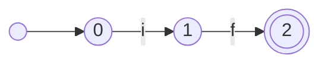
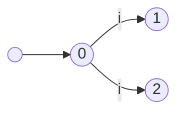
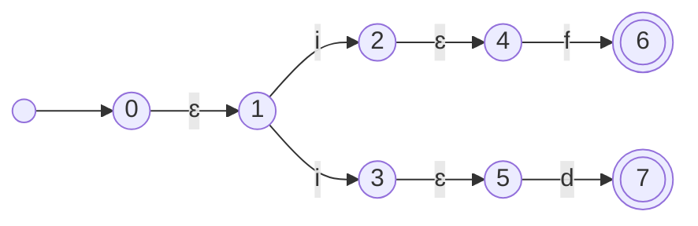
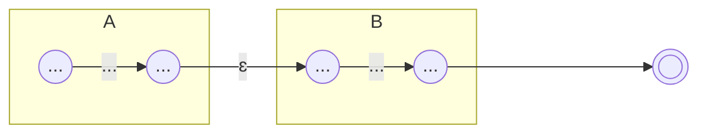
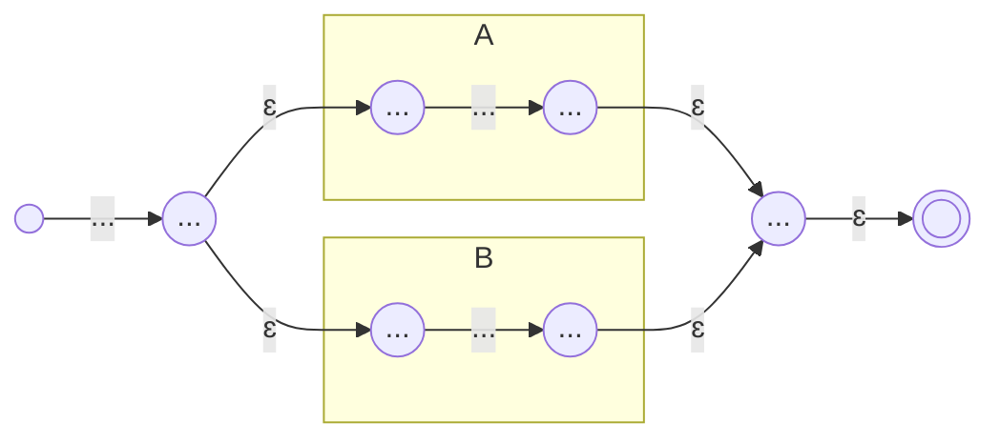
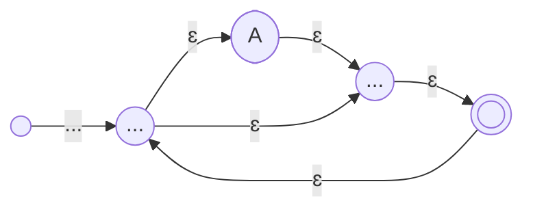

不同于上一章节那么“数学”，这一章我们会讲得比较“编译原理”。

在上一章里，我们说过一个正则表达式对应一个 DFA，识别字符串主要使用的技术是自动机技术，特别的是确定性有穷自动机，那么什么是自动机呢？在编译原理中，我们会具象的表示一个自动机。例如：一个能在文本中识别出`if`这个串的 DFA 长这个样子。



在这里，一个圆圈代表一个“状态”，一个有向边代表一个“转移”，一个双圈圆圈代表“接受状态”。在本门课中所有的 DFA 有且仅有这三个元素。识别`if`的过程是这样的：我们一开始处于初始状态，初始状态在本书中一般是有一条从虚空中转移来的边的结点，且命名为 0(当然也可以命名为其它的)，当我们输入一个`i`,我们就从状态 0 转移到状态 1，当我们再输入一个`f`，我们就从状态 1 转移到状态 2，此时输入结束并且处于一个接收状态上，识别成功。如果在状态 0 上输入了任何一个非`i`字符或者在状态 1 上输入了任何一个非`f`字符或者在状态 2 时输入未结束，则该字符串不被该 DFA 识别。

::: warning

注意：计算理论中会把不被识别的情况转移至空集，在本课中你不需要也不该那么做，尽管助教能识别该符号，但它是不符合本门课的规范的。

:::

这个识别的过程也暗示我们确定性有限自动机的“确定”指的是什么：在任一时刻自动机只会处于唯一的状态，接受一个输入所转移的状态唯一。
比如，这个就不是一个 DFA：



有穷自动机的有穷指的是，一个 DFA 的状态是有限的。之前我们说过的$\left \{ 0^n1^n|n是正整数 \right\}$这个集合就无法被一个有限自动机所表示。

好了，现在人类端应当知道怎么看和怎么用一个 DFA 了，那机器端该如何做呢？刚刚我们的文字识别过程可以很好地写成一段代码。

```c
int state = 0
while(ch = getchar() != '\0')
{
    if(state == 0 && ch == 'i')
    {
        state = 1;
    }
    else if(state == 1 && ch == 'f')
    {
        state = 2;
    }
    else if(state == 2 && ch == EOF)/*这里让我们认为每个输入结尾必定跟一个EOF吧，实际情况当然不是这样 */
    {
        accept();
    }
    else
    {
        error();
    }
}
```

当然有的同学就发现了，这不对啊，光是识别两个字符编码工作量都有点大了，要是真到了实际中不是累死人？yes and no.的确，编译器前端的工作被称为苦力活的原因就在于此，但是前人以及聪明的人把这个工作变成了填表。上述自动机可以表示成这样。
||i|f|EOF|other|
|-|-|-|--|-----|
|0|1|err|err|err|
|1|err|2|err|err|
|2|err|err|acc|err|

上面的表我们叫他 map 吧，于是代码就可以变成这样：

```c
int state = 0;
while(ch = getchar() != '\0')
{
    state = map[state][ch];/* 什么动态规划 */
    if(state == err) error();
    else if(state == acc) accept();
}
```

于是，写代码就变成了填表，某种意义上来说就变成了“画确定性有限自动机”。结合上一章节的内容就变成了“看正则表达式，画确定性有限自动机，填表”。但是问题出现了，一些比较简单的正则表达式尚可能通过“瞪眼法”画出 DFA，但是一旦 DFA 复杂了并且数量多了，再想通过这个方法画出来可就难多了。

幸运的是，计算机的前人们发明了另一个好用的工具“非确定性有穷自动机(NFA)”，相较于 DFA，NFA 的改动是：

1. 允许遇到一个字符时有多个转移边及状态，这也是“非确定性”的来源。
2. 允许空转移，也就是存在状态可由遇到$\epsilon$转入转出。

也就是说一个经典的 NFA 长这样：



引入 NFA 的原因有两个，一个是它符合人类的阅读直觉，二是它可以很容易地和正则表达式一一对应。
比如

1. $\mathbf{AB}$



2. $\mathbf{A|B}$



3. $\mathbf{A^*}$



三大正则表达式都被表达成 NFA 后，所有的正则表达式都可以从左到右按序翻译。

从 NFA 到 DFA 用的是子集构造法，分为以下步骤：

1. 计算某个结点的 ɛ 闭包，定义为从某结点出发，包括某结点点，经由 ɛ 转移边所到结点的集合。
2. 根据某个 ɛ 闭包得到非 ɛ 转移边的下一个结点。
3. 重复 1。

由子集构造法得到的 DFA 未必最简，下面介绍 DFA 最小化算法：

1. 将 DFA 划分为非接受集合和接受集合。
2. 先从非接受集合开始，计算其中每一个结点依据某转移的下一个结点，根据处于或不处于某个现有集合的条件，重新划分现有集合。
3. 重复 2 直到不可再划分。
4. 对接受集合进行 2。

下面给出一个从正则到 NFA 到 DFA 到最小化的例子：


